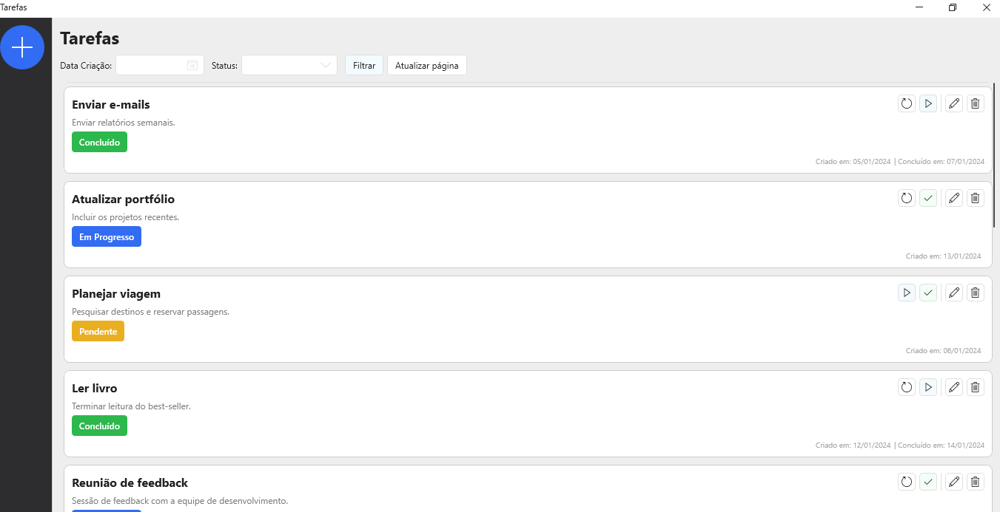

# Aplicativo Todo List (WPF)

Um aplicativo simples para gerenciar tarefas, desenvolvido em WPF com arquitetura de **Vertical Slices**.

## Estrutura do Projeto

- **Application**: Camada de front-end (WPF) com serviços para comunicação com a API.
- **Infrastructure**: Repositórios e `DatabaseContext` para acesso a dados (Entity Framework).
- **Domain**: Modelos de dados e validações (FluentValidation).
- **Presentation**: API para expor endpoints e integrar com o front-end.

## Bibliotecas Utilizadas

- **HandyControls**: Componentes UI modernos e personalizáveis para WPF.
- **CommunityToolkit.MVVM**: Simplifica a implementação do padrão MVVM.
- **Refit**: Cliente HTTP para comunicação com a API de forma declarativa.
- **FluentValidation**: Validações robustas no modelo de domínio.
- **EntityFramework**: Mapeamento objeto-relacional (ORM) para banco de dados.
- **Microsoft.Extensions.DependencyInjection**: Framework para injeção de dependência, permitindo gerenciar as dependências da aplicação de forma desacoplada e configurável. Suporta diferentes escopos de vida útil dos serviços, como Singleton, Scoped e Transient.

## Configuração  (Escolha um dos métodos)
### Método 1: Docker (não necessita de banco de dados instalado)

A API será criada em um container no Docker utilizando Sql Server. 

```#!/bin/bash
git clone https://github.com/Alvarez-T/YourTask.git
cd YourTask
docker-compose build
docker-compose up migrations
docker-compose up
```

### Método 2: copiar e colar no Prompt de comando (Necessário possuir SQL Server instalado)

```#!/bin/bash
git clone https://github.com/Alvarez-T/YourTask.git
cd YourTask/YourTask.Infrastructure
dotnet user-secrets init
dotnet user-secrets set ConnectionStrings:DefaultConnection "Server=localhost\SQLEXPRESS;Database=YourTaskDB;User Id=sa;Password=1234Abc!@#;Trusted_Connection=True;"
dotnet tool install --global dotnet-ef
dotnet ef database update --startup-project ../YourTask.Presentation
cd ../YourTask.Presentation
dotnet run
```

### Método 3: Passo à passo manual

1. **Clone o repositório**:
  ```bash
  git clone https://github.com/Alvarez-T/YourTask.git
  cd YourTask
  ```
2. **Defina o User Secrets** (configure o ConnectionString e senha com base no seu servidor local)
 ```bash
 cd /YourTask.Infrastructure
 dotnet user-secrets init
dotnet user-secrets set ConnectionStrings:DefaultConnection "Server=localhost\SQLEXPRESS;Database=YourTaskDB;User Id=sa;Password=1234Abc!@#;Trusted_Connection=True;"
 ``` 
3. **Instale EF Core CLI Tools** (caso não esteja instalado):
```bash
dotnet tool install --global dotnet-ef
```
4. **Aplique as migrações do EF Core**
```bash
dotnet ef database update --startup-project ../YourTask.Presentation
```
5. **Execute a API (Presentation)** para persistência de dados.
```bash
cd ../YourTask.Presentation 
dotnet run
```
6. Execute o projeto WPF (Application) para iniciar a interface.
7. Crie e edite novas tarefas.

# Screenshots

### Tela principal



### Cadastro de Tarefa

